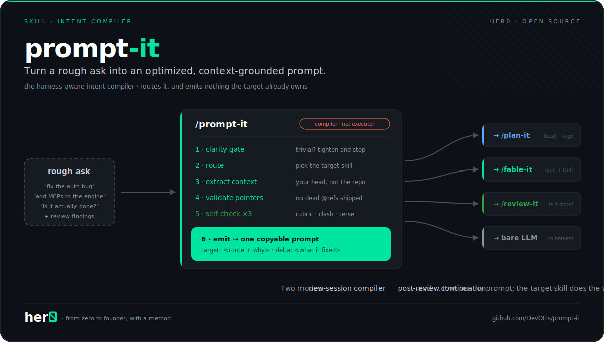
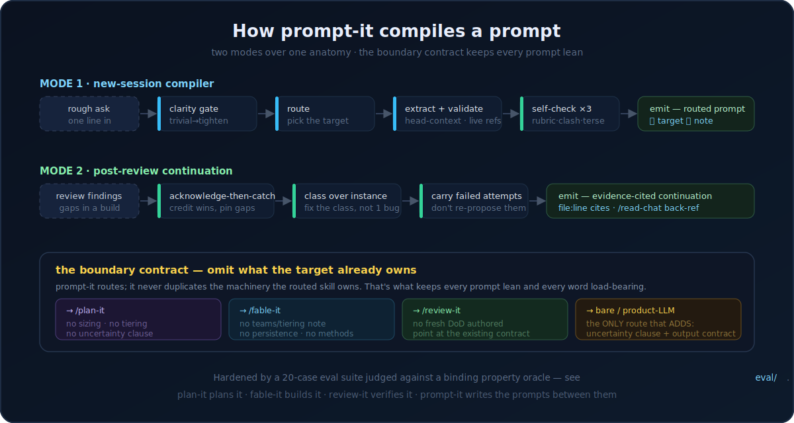

<div align="center">

<h1>prompt-it</h1>

<h3>
  <strong>Turn a rough ask into an optimized, context-grounded prompt.</strong>
</h3>

<p>
  Hand it a one-liner, a half-formed idea, or a pile of review findings.<br>
  <strong>Get back one copyable prompt — routed to the right skill, with every word load-bearing.</strong>
</p>

<p>
  <em>The intent compiler for the <a href="https://github.com/DevOtts/plan-it">*-it</a> family: plan-it plans it, fable-it builds it, review-it verifies it — prompt-it writes the prompts between them.</em>
</p>

<a href="#how-it-works">
  
</a>

<p>
  <a href="#installation"></a>
  <a href="https://opensource.org/licenses/MIT"></a>
  <a href="https://claude.ai/code"></a>
  <a href="#platform-compatibility"></a>
  <a href="https://github.com/DevOtts"></a>
</p>

<p>
  <a href="#installation">Install</a>
  &nbsp;·&nbsp;
  <a href="#the-bottleneck-it-kills">Why</a>
  &nbsp;·&nbsp;
  <a href="#how-it-works">How it works</a>
  &nbsp;·&nbsp;
  <a href="#the-boundary-contract">The boundary contract</a>
  &nbsp;·&nbsp;
  <a href="#eval-hardened">Eval-hardened</a>
  &nbsp;·&nbsp;
  <a href="#whats-inside">What's inside</a>
  &nbsp;·&nbsp;
  <a href="#platform-compatibility">Platforms</a>
</p>

> [!NOTE]
> **A prompt compiler, not an executor.** It writes the prompt that gets the task done right — then hands it to the skill that does the work.

<br>
</div>

The best prompt is not the longest — it's the one where every word is load-bearing. But the prompt you *type* is rarely that prompt. It's conditioned on everything already in your head: which prior session you mean, which file to mirror, which URLs you saw, which boundaries you're silently assuming. Downstream skills pre-ground themselves in your *repo*; none of them can recover what's in your *head*. So the rough ask goes in under-specified, the agent fills the gaps by guessing, and you pay for it in re-prompts.

`prompt-it` is the step that fixes this, packaged as one command. It reads your rough ask, decides **which skill should run it**, extracts the context that lives in your head (and validates it against disk in seconds, not a research pass), then emits **one copyable prompt** shaped exactly for that target — carrying nothing the target already owns. Two modes: a **new-session compiler** for a fresh ask, and a **post-review continuation** that turns review findings into the next iteration's prompt.

## The bottleneck it kills

You type *"add MCP support to the brain."* Pasted straight into a build agent, that becomes: a greenfield design for a subsystem that half-exists, an invented integrations schema, four architecture calls you never saw, and a "done" report verified against nothing. Not a capability problem — a **framing** problem. The agent never had your goal, your reference implementation, your scope fence, or a checkable definition of done, because none of them were in the sentence you typed.

`prompt-it` supplies exactly that missing layer — and no more. It doesn't plan the feature (that's `plan-it`), doesn't build it (`fable-it`), doesn't verify it (`review-it`). It writes the prompt that invokes the right one of those **well**: goal surfaced, context pointed at (not pasted), scope fenced, definition-of-done sketched to the altitude the target can lock — and everything the target skill already handles left deliberately out.

<a href="#how-it-works">
  
</a>

## Installation

`prompt-it` ships as both a **Claude Code plugin** and a portable **`SKILL.md`** (the workflow, on any agent). Pick your tool.

> [!TIP]
> **Universal installers** understand the `SKILL.md` standard and drop the skill into the right place for 70+ tools — use these if your agent isn't listed below:
> ```sh
> npx skills add DevOtts/prompt-it -a <agent>   # e.g. -a cursor, -a codex ; add -g for global
> gh skill install DevOtts/prompt-it            # GitHub CLI
> ```
> Peek first with `npx skills add DevOtts/prompt-it --list`.

### Claude Code  ·  *native*

```sh
# 1. Register the marketplace
/plugin marketplace add DevOtts/prompt-it

# 2. Install the plugin (plugin-name@marketplace-name)
/plugin install prompt-it@devotts
```

That's it. Type `/prompt-it` followed by your rough ask, or just describe what you want and ask for "the prompt for it." `prompt-it` shares the `devotts` marketplace with `plan-it`, `fable-it`, and `review-it` — if you've already added any of them, `/plugin install prompt-it@devotts` is all you need.

### Cursor · Codex · VS Code + Copilot · Others

```sh
npx skills add DevOtts/prompt-it -a cursor      # Cursor
npx skills add DevOtts/prompt-it -a codex       # OpenAI Codex CLI  (or: gh skill install DevOtts/prompt-it)
npx skills add DevOtts/prompt-it -a copilot     # VS Code + GitHub Copilot
```

For **OpenCode · Windsurf · Zed · Gemini CLI · Cline · Amp · Warp** and the rest, the same `npx skills add DevOtts/prompt-it -a <agent>` pattern applies. Any tool that reads a `SKILL.md` can run the workflow — see [Platform compatibility](#platform-compatibility).

### Manual  ·  *any agent*

Copy [`SKILL.md`](SKILL.md) into your agent's skills/rules directory (e.g. `~/.claude/skills/prompt-it/`, `.cursor/rules/`, `AGENTS.md`). The skill is self-contained; its one companion file, [`references/targets.md`](plugins/prompt-it/skills/prompt-it/references/targets.md), rides alongside it.

## How it works

`prompt-it` runs one of two modes over a shared **six-slot anatomy**, and both are governed by a single rule: *emit only what the routed target parses; omit everything it already owns.*

### Mode 1 — the new-session compiler

You hand it a rough ask; it hands back the prompt to start a fresh session with.

1. **Clarity gate.** If the ask is already clear, scoped, and routed, it does a minimal tighten and stops — no ceremony on a one-line fix. Over-engineering trivial asks is the first failure mode of every prompt "optimizer," and the gate exists to refuse it.
2. **Route.** It picks the target skill — `plan-it` for a fuzzy or large idea, `fable-it` for a goal with checkable done-ness, `review-it` for "is it actually done?", `iterate` for a single fix-test-verify loop, or a **bare / product-LLM** target when no harness fits. A route *you* name is locked — it never overrides your call.
3. **Extract head-context.** The core move: surface what you know that the agent doesn't — the session you're gesturing at (resolved against your history ledger), the file you half-named, the reference implementation to mirror, the evidence URLs. Cheap lookups first; at most three grounded, concrete-option questions for what lookups can't resolve.
4. **Validate pointers.** Every `@file`, every `/read-chat` alias, every pattern-to-imitate is checked to exist — in seconds. A prompt with a dead pointer is worse than one with no pointer; the downstream session burns its first turns chasing a ghost.
5. **Self-check ×3.** A five-item rubric (grounded · scoped · actionable · faithful · complete-enough), a contradiction diff across the DoD and constraints, and a load-bearing audit that cuts every word that isn't pulling weight.
6. **Emit.** One copyable prompt block, a `🎯 Target:` line naming the route and why, and a `💡` line calling out the single most important thing it fixed or added. Nothing else — the response *is* the artifact.

### Mode 2 — the post-review continuation

`review-it` (or any QA pass) found gaps in a finished build. `prompt-it` turns them into the prompt for the next iteration — modeled on the hard-won "acknowledge-then-catch" style:

- **Acknowledge, then catch** — credit what's verified working (with its evidence) before pinning each gap, so the next session doesn't re-fix what already works.
- **Class over instance** — diagnose whether each finding is a point defect or an instance of a class, and frame the mechanism-level fix from assets that already exist.
- **Carry the failed attempts** — list what was already tried and rejected (pulled from the run's memory / the review findings) so the next session doesn't re-propose it.
- **Package it** — an evidence-cited continuation prompt with `file:line` citations, a `/read-chat` back-reference to the review session, and the existing test contract named as the verification target.

## The boundary contract

This is the design center, and the reason a `prompt-it` prompt reads lean where a hand-written one sprawls. Every target skill in the family owns machinery — and `prompt-it` refuses to duplicate any of it into the prompt:

| Route | It never emits | Because that belongs to |
|---|---|---|
| **plan-it** | sizing/shape decisions, delegation/tiering notes, uncertainty clauses | plan-it's own scope governor and decision gates |
| **fable-it** | "use Claude teams / lower models" tiering, persistence & autonomy clauses, verification *methods* | fable-it's model-tiers reference and run-state contract |
| **review-it** | any freshly-authored DoD, how-to-verify instructions | review-it's oracle ladder — you point at the *existing* contract |
| **iterate** | cycle structure, multi-step epic scaffolding | iterate's own diagnose→fix→verify loop |
| **bare / product-LLM** | *(the one route that ADDS slots)* | nothing downstream owns them — so the prompt carries an explicit uncertainty clause + output contract, and for agents, stop conditions |
| **any route** | credentials, model-economics content | the environment and the target skill |

Telling `fable-it` to "split the work across teams and use cheaper models" isn't help — it's re-deciding something `fable-it` already decides canonically, and the moment that note drifts out of sync it's a bug. **Routing to `fable-it` *is* the tiering decision.** The boundary contract is what makes that true.

## Eval-hardened

`prompt-it` isn't tuned by vibes. It ships with a **20-case evaluation suite** — [`eval/`](eval/) — spanning every route, both modes, clarity-gate trivial cases, a dead-pointer trap, a legitimate-ambiguity case, and a tiering-note-that-must-be-stripped case.

- [`eval/sample-prompts.md`](eval/sample-prompts.md) — 20 rough asks with a coverage matrix.
- [`eval/expected-prompts.md`](eval/expected-prompts.md) — the **binding property oracle**: per sample, a checklist of what the output *must* contain and *must not* contain (route, slots present/omitted, `🎯`/`💡` lines, ≤10 directives, intent preserved). The oracle judges **properties**, never byte-equality — LLM output varies; the contract is what holds.
- [`eval/scripts/run-eval.sh`](eval/scripts/run-eval.sh) — runs any sample through the *installed* plugin in a fresh session, so the eval tests the real trigger path, not a simulation.

Every release is judged against that oracle by review-it-contract judges before it ships, and the judgments live in the repo as the regression baseline. The suite has already earned its keep — it caught a false premise in one of its own samples and an over-strict rule in its own oracle, alongside the skill defects it was built to find.

## What's inside

```
prompt-it/
├── SKILL.md                                    # the skill (root copy)
├── plugins/prompt-it/
│   ├── .claude-plugin/plugin.json              # plugin manifest
│   └── skills/prompt-it/
│       ├── SKILL.md                            # the skill — clarity gate, routing, 2 modes, self-check
│       └── references/targets.md               # per-target profiles: what each route parses vs. owns
├── .claude-plugin/marketplace.json             # devotts marketplace entry
├── eval/                                        # the 20-case eval suite + binding oracle + runner
├── assets/                                      # hero + pipeline diagrams
├── CHANGELOG.md · LICENSE · README.md
└── docs/                                        # research, synthesis & prompt examples — the design brief this skill was built from
```

The skill is deliberately small: the load-bearing rules live in a **hard-rules box at the top of `SKILL.md`** (first-character output discipline, emit-first, locked routes, the per-route omission table), and the full per-target detail lives in `references/targets.md`. Small and legible is the point — a bloated skill inherits the instruction-stacking failure mode it exists to prevent.

## prompt-it × the family

`prompt-it` is the front door to the front door. It doesn't replace any family skill — it makes the others easier to invoke well.

```
                        rough ask ─┐
                                   ▼
                              ┌───────────┐
                              │ prompt-it │   compile intent → routed prompt
                              └─────┬─────┘
        ┌───────────────┬──────────┼───────────┬──────────────┐
        ▼               ▼          ▼           ▼              ▼
   ┌─────────┐   ┌───────────┐  ┌────────┐  ┌─────────┐ ┌────────────┐
   │ plan-it │   │  fable-it │  │ iterate│  │review-it│ │ bare / LLM │
   └────┬────┘   └─────┬─────┘  └────────┘  └────┬────┘ └────────────┘
        │  plans it    │ builds it                │ verifies it
        └──────────────┴──── gaps found ──────────┘
                                   │
                                   ▼
                   prompt-it (Mode 2) ── continuation prompt ──▶ next iteration
```

- **prompt-it → plan-it / fable-it** — the routing line makes the optimized prompt open with the right skill call, so a fuzzy idea reaches the planner and a goal-with-DoD reaches the builder.
- **review-it → prompt-it → main thread** — after a QA pass reports gaps, Mode 2 writes the evidence-cited continuation prompt that drives the next iteration.
- **Distinct from `/next-session-prompt`** — that skill hands off a *finished* plan/spec; `prompt-it` compiles *new* intent (Mode 1) or *post-review* continuations (Mode 2).

## Platform compatibility

`prompt-it` is native on **Claude Code** and portable everywhere the `SKILL.md` standard is understood — **Cursor, OpenAI Codex, VS Code + GitHub Copilot, OpenCode, Windsurf, Zed, Gemini CLI, Cline, Amp, Warp**, and any agent that reads a skill/rules file. The workflow is model-agnostic in shape; deep layered rule-following runs best on a frontier-tier model (the tier your session already uses), and the skill states its output discipline mechanically so lighter models comply too.

## Security considerations

- **No credentials, ever.** `prompt-it` refuses to embed API keys, tokens, or secrets in a generated prompt — it writes `requires [ENV_VAR_NAME]` or "assumes `<service>` is authenticated" instead.
- **Pointer validation is read-only.** It runs `ls`/`grep`/index lookups to confirm pointers exist; it does not modify your repo, and it never runs the task it's compiling a prompt for.
- **No silent rewrites.** Anything it changed about your intent surfaces in the `💡` line — the audit trail is the value.

## License

[MIT](LICENSE) © [DevOtts](https://github.com/DevOtts)

<div align="center">
<br>
<sub>Part of the <strong>*-it</strong> delivery family · <a href="https://github.com/DevOtts/plan-it">plan-it</a> · <a href="https://github.com/DevOtts/fable-it">fable-it</a> · <a href="https://github.com/DevOtts/review-it">review-it</a> · <strong>prompt-it</strong></sub>
<br><br>
<sub>Authored by <a href="https://github.com/DevOtts">DevOtts</a></sub>
</div>
